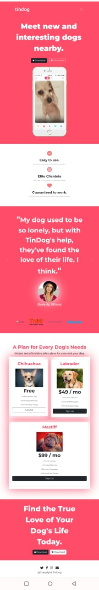

# TINDOG

A Tinder for Dogs type website implemented using majorly bootstrap

# USER INTERFACE

## RESPONSIVE
<table>
  <tr>
    <td>DESKTOP VIEWPORT</td>
     <td>SMARTPHONE VIEWPORT</td>
  </tr>
  <tr>
    <td></td>
    <td></td>
  </tr>
 </table>

## 🚀 ABOUT ME
Hi 👋, I'm Harshit Sharma

🌱 I’m currently learning about Data Structures and Algorithm , Web Development, ,UI/UX , Cinematography , Video Editing

👨‍💻 All of my projects are available at https://github.com/HARSHITSHARMA18

💬 Ask me about Data Structures and Algorithm ,Html , CSS , JavaScript , UI/UX ,Web Design, Pinterest Branding and Growth

📫 How to reach me 18harshitsharma11@gmail.com
